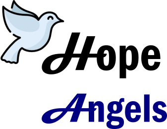

# HopeAngels

## Projeto sendo realizado utilizando :+1: Node.js, React.js e MongoDB com mongoose como ORM.
- A grande motivação por trás é aprender cada vez mais sobre a stack javascript e ficar por dentro dessas tecnologias.

